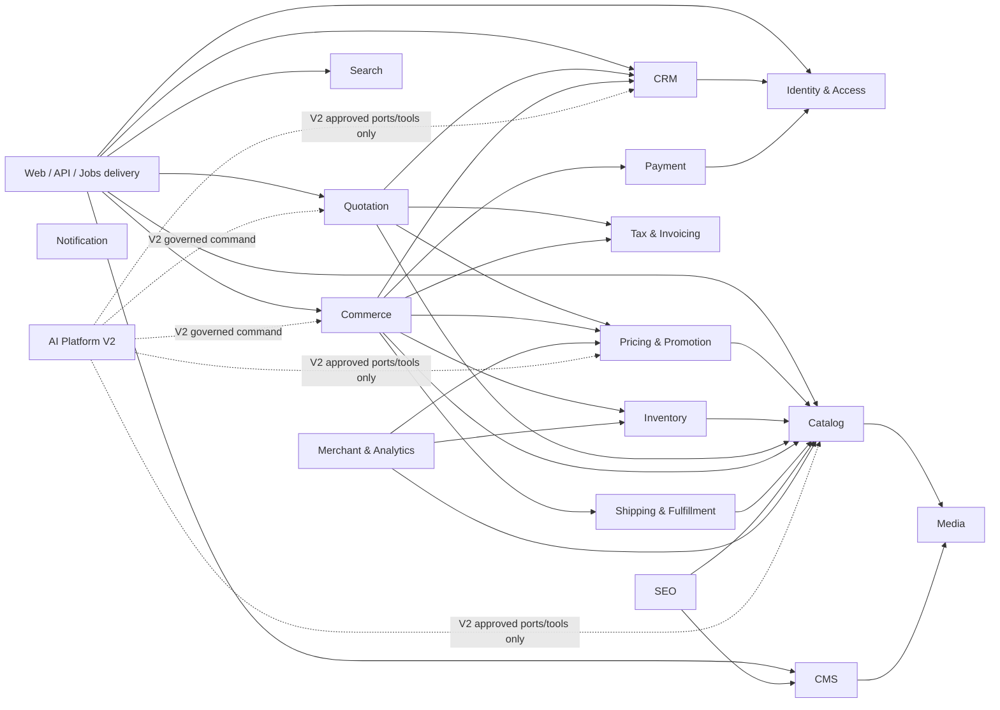

# Step 05 — V1 Domain Boundaries

## 1. Control

- Status: `APPROVED V1 DOMAIN MAP`
- Approval date: 2026-08-23 (Asia/Bangkok)
- Approval basis: Product Owner delegated selection of the most reasonable design; reviewed against approved Step 03 rules and Step 04 architecture
- Scope: logical ownership, allowed application dependencies, forbidden coupling and conceptual fact events
- Not approved here: database schema/fields, HTTP endpoints, public event names/payloads, permission identifiers, provider contracts or migrations

## 2. Boundary rules

1. A domain exclusively owns its aggregate behavior and persistence implementation.
2. Another domain may use only an explicitly declared application command/query port or a versioned fact-event contract.
3. Cross-domain SQL, model/repository imports and foreign persistence mutation are forbidden.
4. Synchronous calls flow only in the approved dependency direction. Reverse updates use facts/events or an orchestration action, never a callback into the caller's internals.
5. MySQL remains authoritative. Redis, search, analytics and Merchant projections never authorize invariant-changing writes.
6. Delivery controllers, jobs and UI are outside domain ownership and call application actions/queries.
7. Conceptual facts below are Step 48 inputs only. Their final public/internal classification, names, versions and payloads are not defined here.
8. AI is a V2 downstream consumer/tool caller. No V1 domain imports AI code, provider SDKs or prompt/model configuration.

## 3. Ownership catalog

| Boundary | Owns | Allowed application surface | Must not own/do |
| --- | --- | --- | --- |
| Identity & Access | Accounts, authentication lifecycle, sessions/revocation, staff 2FA, role/permission assignments, scoped grants, delegation and break-glass authorization evidence | Authenticate actor; authorize action/resource; manage approved grants; query effective capability | CRM profile truth, D-003 financial approval decision, business aggregate mutation or UI-only authorization |
| CRM | Customer, Company, Company membership/contact, Lead, ownership/assignment, duplicate review, conversion/merge and privacy request orchestration | Resolve customer/company context; assign/reassign ownership; convert lead; review duplicate; request privacy action | Authentication credentials, orders/quotes, payment facts or destructive retained-commerce deletion |
| Media | File metadata, usage reference, access classification, quarantine/scan status and image/document variants | Register upload intent; validate/quarantine; attach/detach usage; authorize signed access | Product/Page ownership, public-by-default access or sole authorization metadata in object storage |
| Catalog | Category, Brand, Product, Variant/SKU, product attributes/specifications, sellability and slug lineage | Read sellable product/variant snapshot; manage catalog; publish catalog-change facts | Price, stock, promotion, media bytes or search index truth |
| Pricing & Promotion | Retail/B2B/customer price configurations, simple promotion eligibility/redemption policy and deterministic D-001 calculation | Resolve price; validate/activate configuration; record approved promotion redemption through owning commerce action | Controller/UI pricing, tax calculation, inventory truth or mutation of historical quote/order snapshots |
| Inventory | Warehouse-ready stock balance, movements, reservations and D-002 reserve/release/commit lifecycle | Check/reserve/release/commit; propose/approve adjustment; query authoritative availability | Cart/order state, Redis-only availability truth, negative availability or price calculation |
| Tax & Invoicing | Effective-dated tax classification/rate configuration, deterministic tax calculation/finalization evidence, invoice eligibility/issuance/correction evidence | Calculate tax; finalize/correct tax; evaluate invoice eligibility; record Finance/provider invoice outcome | Product price, order/payment state, hard-coded rates or rewriting issued document snapshots |
| Quotation | Quote request, immutable revisions, QTE-L1 lifecycle, D-003 approvals, QVALID-D1 validity, acceptance/rejection and exactly-once conversion identity | Create/submit/process/send/view/accept/reject/expire revision; approve; convert through orchestration | Order fulfillment, stock balance, payment capture or mutation of Sent/Accepted revisions |
| Commerce | Guest/authenticated Cart, deterministic merge, Checkout orchestration, Order aggregate and ORD-L1/CANCEL-D1 lifecycle/snapshots | Manage cart; place idempotent order; confirm/cancel/advance order using verified domain evidence; query order | Payment/provider truth, shipment tracking truth, direct foreign-table writes or AI dependency |
| Payment | Payment intent/attempt/transaction/refund facts, verified callbacks, unknown-result reconciliation and provider adapter state | Initiate approved payment; verify/apply callback; query verified evidence; request eligible full refund | Order lifecycle, client-declared success, tax/invoice mutation or provider SDK leakage into Commerce |
| Shipping & Fulfillment | Shipping method configuration, shipment/item, dispatch/tracking evidence, SHIP-D1 correction and carrier reconciliation | Quote configured fee/method; create shipment; confirm dispatch; apply/correct tracking; query fulfillment evidence | Order/payment/inventory truth, synchronous carrier dependency for core order creation or reopening terminal delivery in V1 |
| CMS | Page, Article, FAQ, Banner, publication workflow/schedule and email-template content | Manage content; publish/unpublish/schedule; render approved public content/template | Catalog/product truth, SEO crawler policy ownership, media bytes or arbitrary executable templates |
| SEO | Canonical/indexation rules, sitemap/robots generation, structured-data composition and redirect policy/read model | Produce page metadata/schema/canonical/robots/sitemap from approved source snapshots | Invent product/price/stock/review values or become content/catalog truth |
| Search | Replaceable query adapter and rebuildable projection of approved Catalog/CMS/public data | Search/filter/autocomplete; index/rebuild/delete projection; report freshness | Source-of-truth writes, authorization decisions or coupling domain code to a search engine |
| Notification | Delivery preferences where approved, message requests/attempts/templates references and provider outcomes | Enqueue/send retry-safe notification; query delivery outcome | Define business transition success, send inside critical transaction or expose provider contract to producers |
| Merchant & Analytics | Merchant feed projection/batches and deduplicated approved analytics event delivery/attribution references | Build/retry feed; export approved facts; record delivery/dedupe evidence | Replace commerce DB with analytics, authorize actions or feed stale/unverified price/stock |
| AI Platform (V2) | Gateway/model/prompt/conversation/tool/RAG/agent/usage/evaluation/audit abstractions after D-008 | Read approved scoped ports; propose governed commands through normal domain actions | Direct DB access, self-authorization, critical-path dependency, autonomous high-impact commit or V1 implementation |

## 4. Approved synchronous dependency graph

An arrow means “may call the target's declared application port.” Absence means no synchronous dependency is allowed.

The graph is acyclic when Delivery and V2 AI are treated as outer consumers. Payment and Shipping never call Commerce synchronously; they publish verified facts that Commerce consumes through approved handlers/orchestration.

## 5. Cross-domain orchestration ownership

| Use case | Orchestration owner | Participating ports | Atomicity boundary |
| --- | --- | --- | --- |
| Lead conversion | CRM application action | Identity authorization; CRM repositories | One CRM transaction; derived side effects after commit |
| Price quote line | Quotation action | Catalog snapshot, Pricing resolver, Tax calculator | Quote revision transaction freezes returned snapshots |
| Place checkout order | Commerce Checkout action | CRM context, Catalog snapshot, Pricing, Tax, Inventory reserve, Payment/Shipping configuration | Approved local transaction/locking plan in Step 07; provider side effects after commit |
| Confirm order | Commerce action | Verified Payment evidence or approved term evidence | Order expected-version transition; Payment history unchanged |
| Cancel order | Commerce action | Inventory release and Payment refund request | Local cancellation/release rules transaction-safe; external refund reconciled asynchronously |
| Quote to order | Quotation conversion action coordinating Commerce | Pricing/Tax revalidation, Inventory reserve, Commerce create | Exactly one order per Accepted revision; no partial acceptance/order outcome |
| Dispatch | Shipping action plus domain fact handler | Inventory commit; Commerce fulfillment evidence | Shipment evidence authoritative; idempotent handlers update each owning aggregate |
| Privacy request | CRM orchestration | Identity authorization, each owner's approved redaction port, Search/Media cleanup | Resumable tracked workflow; unresolved legal retention fails closed |

Exact transaction layout, lock order and reliable-dispatch representation are Step 07/09 decisions; this map approves ownership only.

## 6. Conceptual fact-event responsibilities

| Producer | Conceptual facts | Typical consumers | Required semantics before Step 48 approval |
| --- | --- | --- | --- |
| Identity & Access | account disabled, grant changed/revoked, emergency access expired | Delivery/session invalidation, audit/security | Durable identity, actor, scope revision; no secrets |
| CRM | customer/company changed, ownership changed, lead converted, privacy cleanup requested/completed | Search, Notification, Analytics | PII classification/minimization and idempotent consumer identity |
| Catalog | product/variant changed, sellability/slug changed | Search, SEO, Merchant, Pricing cache | Source revision and rebuild/delete behavior |
| Pricing | price configuration activated | Commerce/Quotation cache, Merchant | Configuration revision; historical snapshots immutable |
| Inventory | reservation created/released/committed, availability changed, adjustment approved | Commerce, Merchant, Observability | Stable operation identity; duplicates/out-of-order safe |
| Quotation | revision Sent/Viewed/Accepted/Rejected/Expired/Converted | Notification, CRM, Analytics, Commerce orchestration | Revision identity and monotonic lifecycle |
| Commerce | order created/confirmed/cancelled/processing/packed/shipping/delivered/completed | Payment, Shipping, Notification, Analytics | Order revision/idempotency; no client truth |
| Payment | payment verified/failed/unknown/reconciled/refund completed | Commerce, Notification, Finance read models | Verified provider evidence and unique provider-event identity |
| Shipping | shipment created/dispatched/tracking corrected/delivered/exception | Commerce, Inventory, Notification, Analytics | Monotonic evidence; correction lineage |
| CMS | content published/unpublished/slug changed | Search, SEO, CDN invalidation | Content revision and effective time |
| Notification | delivery succeeded/failed/dead-lettered | Owning workflow read models/operations | Delivery result never changes original business fact |

## 7. Forbidden coupling checklist

- No module imports another module's ORM model, migration, repository implementation or provider adapter.
- No direct cross-domain table update, including “convenience” status updates from webhook/job handlers.
- No Payment/Shipping callback mutates Order without verification, mapping and the Commerce application action/handler.
- No Redis lock/cache is the only guard for money, stock, idempotency or permission.
- No Search/Merchant/Analytics result is used for an invariant decision.
- No Notification success/failure defines whether a quote was Sent or order was created.
- No Blade/Livewire/JavaScript condition substitutes for server authorization.
- No AI namespace/provider SDK may be referenced from V1 Commerce, Payment, Inventory or delivery boot paths.

## 8. Verification and approval

| Check | Result | Evidence |
| --- | --- | --- |
| Required V1/V2 boundaries covered | `PASS` | Ownership catalog includes every Step 05 required domain plus Media, Tax and growth projections |
| Single owner for authoritative state | `PASS` | Each aggregate/fact category has one named boundary |
| Synchronous dependency cycle | `PASS — NONE` | Approved graph has no return edge from providers/projections to owning orchestrators |
| Commerce independent of AI | `PASS` | AI is V2 outer consumer; forbidden coupling explicitly tested later |
| Public API/event/schema invented | `PASS — NONE` | Only application-port responsibilities and conceptual facts are named |
| Product/Architecture approval | `APPROVED` | Product Owner delegated reasonable selection; Architecture review recorded 2026-08-23 |

Step 05 is complete. Step 06 may model entities/cardinalities from these ownership boundaries without creating migrations.
