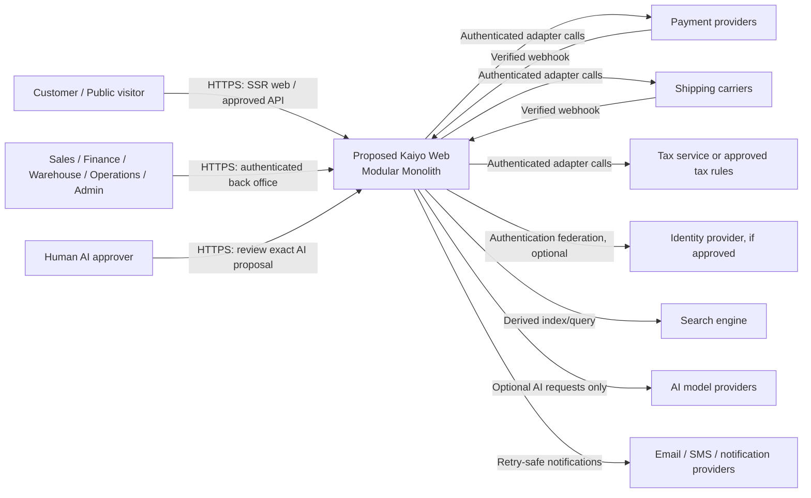
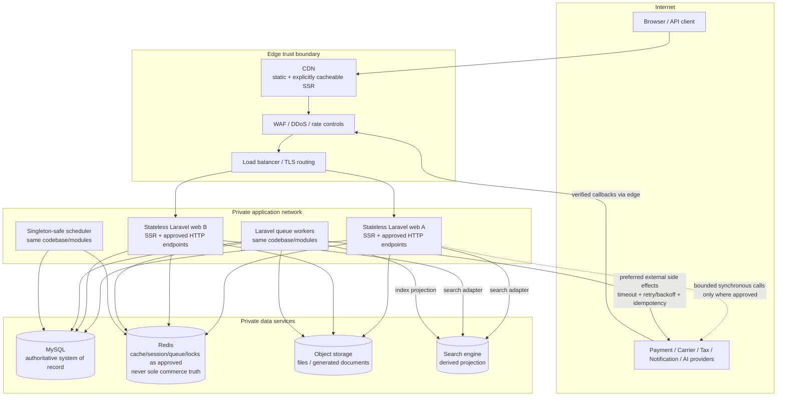
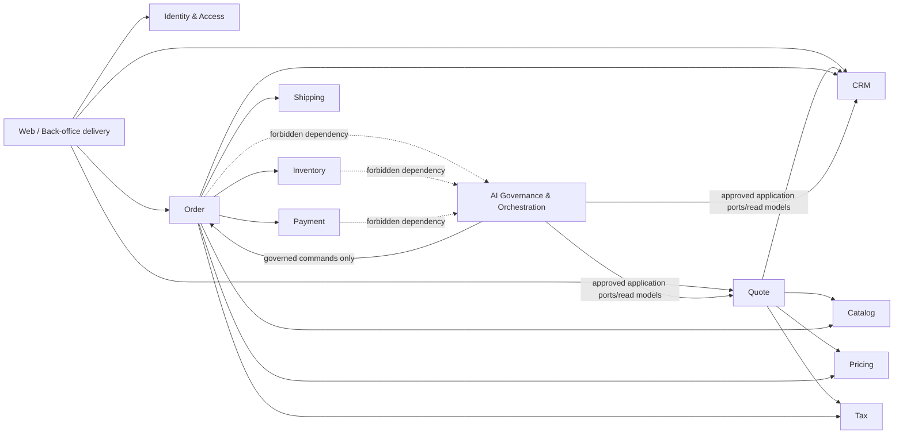
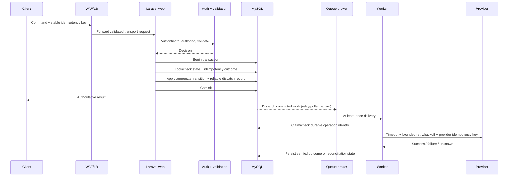
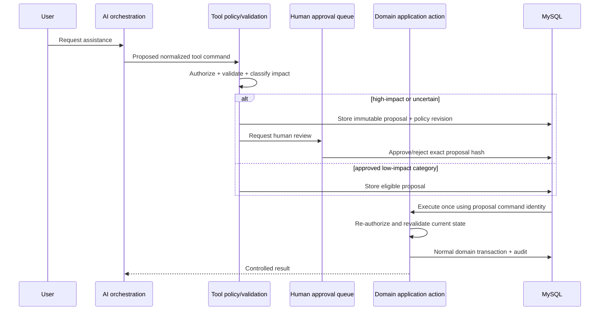

# System Architecture — PROPOSED / UNAPPROVED

## 1. Decision status

**Document status: PROPOSED — UNAPPROVED.** This document is a production-oriented architecture proposal authorized for review on 2026-08-22. It is not an ADR and does not approve stack versions, cloud vendors, schemas, public APIs/events, SLO targets, roles, or business workflows.

The architecture follows the currently approved constraints:

- Modular Monolith by default; service extraction requires evidence and an approved ADR.
- MySQL is the source of truth; Redis is not truth for order, payment, or inventory.
- Critical writes are transaction-safe; retryable writes and jobs are idempotent/retry-safe.
- External APIs use timeout and bounded backoff.
- SEO-critical public content is server-rendered.
- Authorization is server-side.
- AI/LLM is outside critical checkout, payment, and inventory paths.
- AI writes pass policy, validation and idempotency; high-impact actions require human approval.
- Prompts, model IDs, provider keys, thresholds and business settings are configuration-managed, not hard-coded.

Related documents:

- [Business Rules Matrix — Proposed](../business/business-rules-matrix.md)
- [Repository Audit](../audits/repository-audit.md)
- [Risk Register](../audits/risk-register.md)
- [Dependency Roadmap](../audits/dependency-roadmap.md)
- [AI Engineering Governance](../governance/engineering-governance.md)

## 2. Scope

### In scope

- Production topology: web, CDN, WAF, load balancer, stateless Laravel, MySQL, Redis, queues, object storage, search adapter, and AI platform adapters.
- Logical module boundaries for a Modular Monolith.
- Context, container, module-dependency, and critical-flow diagrams.
- NFR-to-component/control mapping.
- Failure boundaries, data ownership and service-extraction criteria.

### Out of scope pending approval

- Exact Laravel/PHP/Node versions and package selection.
- Cloud/vendor/product selection, regions and account topology.
- Database schema, fields, indexes and migrations.
- Public API/event contracts and webhook payloads.
- Exact roles/permissions and business rule approval.
- Numerical SLOs, RTO/RPO, traffic, retention, performance and cost budgets.
- Detailed network CIDRs, infrastructure-as-code and deployment pipeline.

## 3. Architecture principles

1. One deployable Laravel application and its queue/scheduler processes share the same codebase and domain modules.
2. Modules communicate through explicit application interfaces and in-process domain events; direct access to another module's persistence internals is prohibited.
3. Synchronous operations enforce local invariants in MySQL transactions. External side effects happen after commit through a reliable, retry-safe dispatch mechanism.
4. Redis accelerates cache/session/coordination/queue use cases only where approved; correctness cannot depend on Redis as the sole durable record.
5. Search is a derived projection behind an adapter; MySQL remains authoritative.
6. Provider integrations sit behind ports/adapters with authentication, timeouts, bounded retry/backoff, idempotency and reconciliation.
7. Web nodes and workers are horizontally replaceable and keep no required local state.
8. Public SEO-critical pages are SSR; static assets may be cached at the edge using explicit cache/invalidation policy.
9. AI is optional and downstream. Commerce modules have no dependency on AI modules, SDKs or providers.
10. Observability, authorization, privacy and audit are cross-cutting controls, not optional feature concerns.

## 4. System context diagram

Trust-boundary notes:

- Every external response/webhook is untrusted until authenticated, validated, deduplicated and mapped through its adapter.
- Browser/UI assertions never replace server-side authorization or business validation.
- AI output is untrusted input. It cannot mutate domain state without the governed tool path.

## 5. Container diagram

Container responsibilities:

| Container | Responsibility | Must not do |
| --- | --- | --- |
| CDN | Deliver static assets and explicitly cacheable public SSR responses | Cache personalized/private responses or become content truth |
| WAF | Edge filtering, request size/rate controls, managed threat mitigation | Replace application authorization/validation |
| Load balancer | TLS/routing/health distribution across stateless nodes | Hold user/domain state |
| Laravel web | SSR, approved HTTP contracts, server-side authorization, application orchestration | Embed provider details in domain logic; perform unbounded slow work in request path |
| Queue workers | Retry-safe side effects, projections, integrations and background work | Treat delivery as exactly-once; use Redis alone for idempotency truth |
| Scheduler | Enqueue due work with singleton/idempotent guards | Directly execute unbounded batches without resumability |
| MySQL | Authoritative aggregates, constraints, idempotency outcomes, audit and reliable dispatch records | Store provider secrets in domain data or rely on application validation alone |
| Redis | Approved cache/session/queue/coordination acceleration | Hold sole truth for order, payment, inventory or authorization grants |
| Object storage | Durable approved files/documents with scoped access | Expose objects publicly by default or replace metadata/authorization in MySQL |
| Search engine | Derived search/index projection | Authorize writes or act as authoritative commerce read for invariant decisions |
| Provider adapters | Translate approved internal ports to external APIs/webhooks | Leak provider contracts into domain modules or retry unsafe writes blindly |
| AI adapters | Execute optional model requests with privacy/safety controls | Be required by checkout/payment/inventory or write domain state directly |

## 6. Modular Monolith module diagram

The module names below are proposed logical boundaries derived from the requested business coverage. They do not approve schemas or APIs.

Module boundary rules:

- Each module owns its domain model and persistence access. Cross-module SQL/table access is prohibited.
- Cross-module commands/queries use explicit application ports with typed inputs/outputs.
- In-process events are internal contracts; external/public events require separate approved contracts and compatibility policy.
- Controllers/console commands/jobs remain thin and call application actions.
- Provider SDKs remain in infrastructure adapters and do not appear in domain modules.
- An automated dependency test must reject commerce core imports of AI code/provider SDKs.

## 7. Critical write and side-effect flow

The exact reliable-dispatch implementation is an ADR decision. The required invariant is: a committed domain change cannot silently lose its required side effect, and a retried delivery cannot duplicate the business effect.

## 8. AI write approval flow

AI-specific boundaries:

- The model never receives DB credentials or direct domain repository access.
- Approval applies to the exact immutable proposal; edits create a new proposal/review.
- Execution rechecks authorization, policy, expiry, expected version and business rules.
- AI/provider failure degrades only the optional AI capability.
- Prompt/model/provider changes are versioned configuration and require evaluation/safety gates.

## 9. Data ownership and consistency

| Concern | Proposed authority | Consistency approach | Derived/optional stores |
| --- | --- | --- | --- |
| CRM records | CRM module in MySQL | Transaction + optimistic concurrency where applicable | Redis cache, search projection |
| Pricing configurations/snapshots | Pricing/owning document modules in MySQL | Versioned immutable snapshot for issued/finalized documents | Cache keyed by configuration revision |
| Inventory | Inventory module in MySQL | Row/range locking or equivalent approved concurrency control; DB constraints | Redis availability cache only if invalidation/freshness policy approved |
| Quotes/orders | Owning module in MySQL | Aggregate transaction + expected-version state transition | Read projections/search |
| Payment facts | Payment module in MySQL based on verified provider evidence | Idempotent event/application records; reconciliation for unknown outcomes | Provider dashboard is external evidence, not local state replacement |
| Shipping facts | Shipping module in MySQL based on verified warehouse/carrier evidence | Idempotent event mapping and monotonic lifecycle rules | Tracking read cache |
| Tax snapshots | Tax/owning document module in MySQL | Deterministic/versioned snapshot; reconciliation if external finalization exists | Provider reference/cache |
| Authorization assignments | Identity & Access module in MySQL | Default deny; revisioned assignment; bounded cache freshness | Redis authorization cache if approved |
| Files/documents | Metadata/authorization in MySQL; content in object storage | Transactional intent plus reconciled object operation | CDN for approved public assets |
| Search | MySQL-owned module data | Asynchronous projection with rebuild/reconciliation | Search engine is entirely derived |
| AI proposals/approvals | AI Governance module in MySQL | Immutable proposal/decision and idempotent execution linkage | Provider request metadata as redacted audit evidence |

Schema details, isolation levels, lock scope, replica topology and consistency budgets remain ADR/contract decisions informed by real access paths and load evidence.

## 10. Queue and integration model

- Assume at-least-once delivery; every job handler must tolerate duplicate, delayed and out-of-order delivery.
- Durable business idempotency outcomes live in MySQL. Redis locks may reduce contention but never provide the only correctness guard.
- Retries are bounded and classified. Validation/authentication/business rejection is not retried; transient failures may use configured backoff; unknown mutation outcomes enter reconciliation.
- Each external call has configured connect/overall timeout, redacted telemetry and circuit/degradation behavior appropriate to the approved workflow.
- Poison messages move to an observable failure state/dead-letter workflow; no destructive purge without approval.
- Webhooks authenticate provider/source before parsing into internal commands and persist a durable event identity before applying effects.
- No public event name or payload is defined by this architecture document.

## 11. Security and privacy boundaries

- TLS at the edge and approved encryption for service/data connections; encryption-at-rest follows selected platform controls.
- WAF/rate controls are defense-in-depth; Laravel still applies authentication, authorization, CSRF/session protections where relevant, validation and output encoding.
- Secrets come from the approved secret manager/configuration mechanism; they are absent from source, logs, prompts and public assets.
- Least-privilege network/service identities isolate application, workers, DB, Redis, search, object storage and external provider access.
- Sensitive audit values are redacted/tokenized while retaining who/what/when/decision/correlation evidence.
- AI data access uses allow-listed data classifications and minimization. PII is excluded/redacted unless an approved use case and legal/privacy basis explicitly permits it.
- Exact threat model, compliance regime, retention, data residency and key-management choices remain approval gaps.

## 12. Deployment and runtime proposal

- Build one immutable application artifact from pinned dependencies; deploy the same revision to web, worker and scheduler roles.
- Web and worker instances are stateless/replaceable; health checks distinguish process liveness from dependency readiness.
- Use backward-compatible expand/migrate/contract deployment for schema changes; destructive/irreversible changes need explicit approval and restore plan.
- Drain requests/jobs and preserve idempotency during rolling deployment/rollback.
- Run migration as a controlled release step, not concurrently from every web instance.
- Separate environments/accounts/credentials according to an approved environment model; production data is not copied to lower environments without approved anonymization.
- Numerical capacity, autoscaling, region/zone topology and release strategy require traffic/SLO/RTO/RPO decisions.

## 13. Observability model

Minimum proposed signals, with exact tooling/retention/thresholds pending approval:

- Structured logs with request/job/correlation IDs and redaction.
- Metrics for HTTP availability/latency/errors, DB saturation/locks, queue lag/failures/retries, cache behavior, search projection lag, object errors and provider outcomes.
- Business-integrity metrics for reservation conflicts, payment unknown/reconciliation backlog, duplicate suppression, failed dispatch records and AI approvals/executions.
- Distributed tracing across HTTP, queue and external adapters where approved and privacy-safe.
- Alerts must be actionable, owned, linked to runbooks and tested; no hard-coded thresholds in application code.
- Audit records are distinct from debug logs and follow approved retention/access controls.

## 14. NFR mapping

Numeric targets are intentionally `TBD — approval required`; inventing them would create unapproved business/operational settings.

| NFR | Proposed architecture control | Verification/evidence | Target/status |
| --- | --- | --- | --- |
| Availability | CDN/WAF/LB, multiple stateless web/worker instances, health checks, degraded optional integrations | Failure-injection and availability/load test | Numeric SLO TBD |
| Horizontal scalability | Stateless web/workers; queue buffering; derived search; object storage | Scale/load test at approved traffic profile | Traffic/concurrency TBD |
| Performance | Edge caching for approved public responses, query/index review, bounded request work, cache by explicit policy | p95/p99 web and queue benchmarks; query-count/N+1 checks | Budgets TBD |
| Data integrity | MySQL authority, transactions, constraints, expected-version transitions and immutable snapshots | Migration/constraint/property/concurrency tests | Rules/contracts pending approval |
| Idempotency | Durable command/event identities and stored outcomes; provider idempotency keys | Duplicate/concurrent/retry tests for every critical flow | Required for critical/retryable writes |
| Consistency | Synchronous local invariants; asynchronous derived projections with lag/rebuild/reconciliation | Projection lag and rebuild tests; stale-read scenarios | Per-read consistency budgets TBD |
| Resilience | Timeout, bounded backoff, circuit/degradation and reconciliation for unknown outcomes | Provider outage/timeout/out-of-order tests | Retry/timeout values TBD |
| Security | WAF defense-in-depth, server-side authorization, least privilege, secret management, secure delivery pipeline | Threat model, SAST/SCA/DAST/config scan and permission tests | No Critical/High unresolved before release |
| Privacy/PII | Data minimization, redaction, scoped storage/access and AI allow-list | Data-flow review, log/prompt scan, privacy tests | Regime/retention/residency TBD |
| Auditability | Immutable/restricted critical audit, correlation IDs, config/rule revision references | Trace critical scenario end-to-end | Retention/access TBD |
| Recoverability | Backups, point-in-time capability where approved, object versioning/lifecycle, tested restore | Restore rehearsal and integrity reconciliation | RPO/RTO TBD |
| Deployability | Immutable artifact, rolling deployment, controlled migration, backward compatibility and rollback | Deployment/rollback rehearsal | Strategy/environment model TBD |
| Observability | Logs, metrics, traces, business-integrity signals and owned alerts/runbooks | Synthetic checks and alert-fire exercises | Thresholds/retention TBD |
| SEO/indexation | Laravel SSR for approved critical public pages; edge cache policy; canonical/meta/schema generation | Rendered HTML, robots/sitemap/canonical/schema and crawler checks | Page inventory/budgets TBD |
| Accessibility | Server-rendered semantic baseline plus frontend component controls | Automated critical checks and manual keyboard/screen-reader review | Conformance target TBD |
| Maintainability | Modular boundaries, thin delivery layer, ports/adapters, architecture tests | Dependency-rule and static-analysis gates | Tooling/version TBD |
| Search correctness | Search as rebuildable projection; source links and lag visibility | Rebuild, reconciliation and stale-index tests | Freshness target TBD |
| Queue correctness | At-least-once design, retry-safe handlers, durable idempotency and dead-letter visibility | Crash/retry/duplicate/poison-job tests | Lag/retry targets TBD |
| AI safety | Optional adapter, policy/validation, immutable proposal, human approval for high impact, evaluation gates | Dependency test, AI outage E2E, safety/evaluation regression | Use cases/metrics TBD |
| Cost efficiency | Horizontal scaling and managed/adapter-based components sized to evidence | Cost/load review against approved forecast | Budget TBD |

## 15. Service extraction policy

No component is a microservice in this proposal. Separate processes for web, queue workers and scheduler are deployment roles of the same Modular Monolith/codebase.

A module may be proposed for service extraction only when evidence demonstrates a boundary problem that cannot be adequately solved inside the monolith, for example:

- Independently measured scaling/resource profile causing material operational impact.
- Isolation requirement backed by security/compliance evidence.
- Availability/failure-domain requirement incompatible with the monolith deployment.
- Team/release contention demonstrated by delivery data and stable contracts.
- Technology requirement with measured benefit exceeding distributed-system cost.

Every extraction requires an approved ADR covering ownership, contract/versioning, data authority, consistency, idempotency, failure modes, observability, security, migration, rollback and cost. Queue load or conceptual domain boundaries alone are insufficient evidence.

## 16. Architecture fitness functions

| Fitness function | Required assertion | Status |
| --- | --- | --- |
| Module dependency | Commerce core cannot import/reference AI module or provider SDK | Proposed; automate when code exists |
| Source-of-truth | Order/payment/inventory writes cannot use Redis/search as sole durable authority | Proposed; automate/static review when code exists |
| Delivery boundaries | Controllers/jobs call application actions and do not embed domain/provider logic | Proposed |
| Database access | Module cannot query another module's persistence implementation directly | Proposed |
| N+1/query budget | Critical endpoints declare/query-count and performance budgets | Pending approved budgets/routes |
| Idempotency | Every critical/retryable command declares durable idempotency strategy and test | Proposed |
| External calls | Adapter calls declare timeout/retry classification and redact telemetry | Proposed |
| SEO | Approved SEO-critical routes return indexable SSR HTML without client JS dependency | Pending page inventory |
| AI outage isolation | Critical checkout/payment/inventory E2E passes with AI disabled/unreachable | Proposed |
| AI write governance | No AI tool bypasses policy/validation/idempotency/approval/domain action | Proposed |

## 17. Open decisions / REPORT GAP

| Decision ID | Required decision | Why it matters | Current status |
| --- | --- | --- | --- |
| ARCH-GAP-001 | Approve/change/reject Business Rules Matrix | Determines states, transactions, module actions and tests | OPEN |
| ARCH-GAP-002 | Exact stack/runtime versions and package policy | Reproducibility, support and security | OPEN |
| ARCH-GAP-003 | Traffic profile, availability/latency/load targets | Capacity, topology and performance gates | OPEN |
| ARCH-GAP-004 | RTO/RPO, retention and backup scope | Data topology, backup and restore design | OPEN |
| ARCH-GAP-005 | Identity model and permission matrix | Security boundary and policy implementation | OPEN |
| ARCH-GAP-006 | Database/API/Event contracts and compatibility policy | Persistence and integration implementation | OPEN |
| ARCH-GAP-007 | Cloud/vendor/region/environment constraints | Concrete network, deployment and operations design | OPEN |
| ARCH-GAP-008 | Search use cases and freshness/consistency requirements | Whether/which search engine is justified | OPEN |
| ARCH-GAP-009 | External payment/carrier/tax/notification contracts | Adapter failure/idempotency/reconciliation behavior | OPEN |
| ARCH-GAP-010 | AI use cases, data classes, impact policy and evaluation criteria | Whether AI is needed and how it can operate safely | OPEN |
| ARCH-GAP-011 | SEO-critical page inventory and accessibility target | Delivery strategy and release verification | OPEN |
| ARCH-GAP-012 | Compliance, privacy, threat model and data residency | Security controls and operational topology | OPEN |

## 18. Approval and ADR plan

Recommended review order:

1. Approve/change/reject business rules and cross-domain invariants.
2. Approve NFR targets and operational constraints.
3. Approve module boundaries and data authority.
4. Record material decisions as ADRs; do not convert this proposal into implicit ADR approval.
5. Define DB/API/Event contracts.
6. Only then scaffold or implement the first approved slice.

| Architecture area | Decision (`APPROVE`/`CHANGE`/`REJECT`) | Decision/ADR reference | Approver | Date |
| --- | --- | --- | --- | --- |
| Context and container topology |  |  |  |  |
| Module boundaries/dependencies |  |  |  |  |
| Data authority/consistency |  |  |  |  |
| Queue/integration model |  |  |  |  |
| AI boundary/governance |  |  |  |  |
| NFR mapping/targets |  |  |  |  |

## 19. Definition of Done status

| Check | Status | Evidence/reason |
| --- | --- | --- |
| Production Modular Monolith proposed | PASS (PROPOSAL) | Edge, stateless Laravel roles, MySQL, Redis, queues, object storage, search and adapters are mapped |
| Architecture diagrams produced | PASS | Context, container, module, critical-write and AI approval diagrams included |
| NFR mapping produced | PASS | Section 14 maps 20 NFRs to controls and verification |
| Commerce core independent of AI | PASS (DESIGN) | Dependency direction, forbidden edges and fitness tests explicitly defined |
| Service extraction evidence/ADR gate | PASS (DESIGN) | Section 15 prohibits extraction without evidence and approved ADR |
| Architecture approved/final | PENDING | Approval table is empty; open decisions remain |
| Runtime verification | N/A | No executable application exists |
