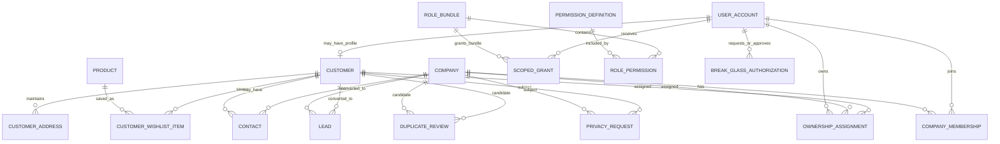
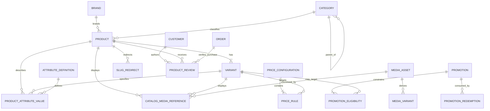
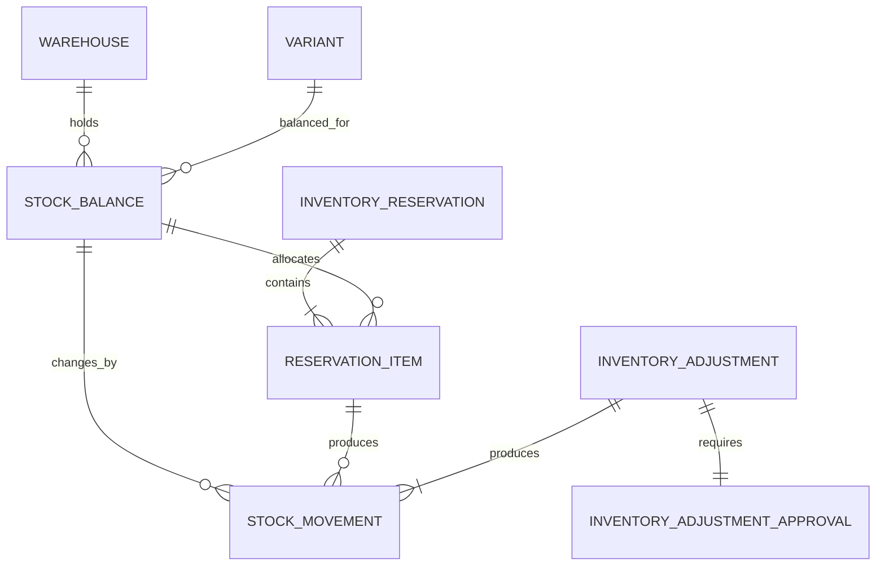
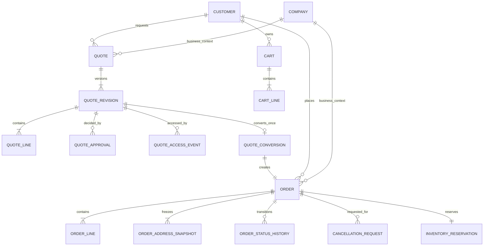
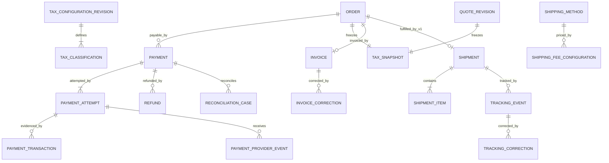
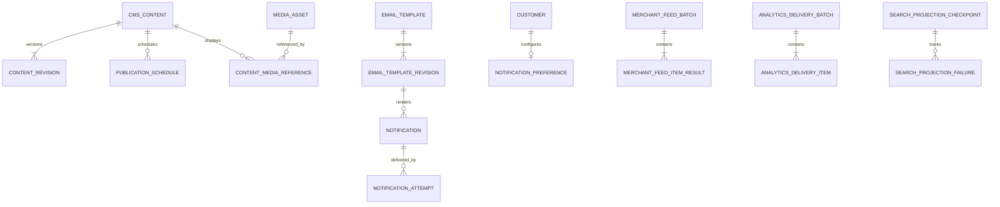

# Step 06 — V1 ERD and Entity Catalog

## 1. Control

- Status: `APPROVED V1 LOGICAL MODEL — PHYSICAL SCHEMA PENDING STEP 07`
- Approval date: 2026-08-23 (Asia/Bangkok)
- Inputs: approved [Business Rules Matrix](../business/business-rules-matrix.md), [System Architecture](./system-architecture.md), [Domain Boundaries](./domain-boundaries.md) and D-001–D-007 records
- Scope: logical entities, aggregate ownership, cardinality, lifecycle vocabulary and immutable snapshot boundaries
- Not approved here: table/column names, SQL types, indexes, constraints syntax, migrations, public API/event payloads or provider fields

Logical references crossing a domain boundary are shown for cardinality/traceability only. Step 07 decides whether a physical FK, immutable copied snapshot or validated identifier is appropriate; no ORM/model coupling is authorized by this ERD.

## 2. Modeling rules

1. Every mutable business aggregate has one owning domain from Step 05.
2. Issued/Sent quotation revisions and placed order financial/address snapshots are immutable.
3. Payment, Order, Shipment, Inventory Reservation and Quotation keep separate lifecycles.
4. Historical facts are append-only where required: stock movements, approvals, status history, provider events, corrections and audit evidence.
5. Customer-facing Order/Quote references one Customer and may reference one Company for B2B; Contacts/memberships do not become duplicated commercial-party tables.
6. Redis/search/analytics/Merchant are projections and are absent from authoritative aggregate diagrams except their checkpoints/delivery evidence.
7. AI entities are V2 extensions only and do not appear in the V1 physical-schema handoff.

## 3. Identity and CRM

| Aggregate/root | Owned entities/evidence | Key logical identity/cardinality | Integrity intent |
| --- | --- | --- | --- |
| User Account | Session/revocation and authentication evidence | One account may map to one Customer profile and many scoped grants | Disabled/revoked accounts fail closed; credentials remain outside CRM |
| Role Bundle | Role Permission | Many permissions per bundle; bundle is configuration, not authorization truth by label | Effective permission derives from active scoped grant plus current policy revision |
| Scoped Grant | Scope/delegation/revocation evidence | One grant links account, bundle/capability and an approved resource scope | Cannot delegate authority not held; high-impact grant dual control |
| Break-glass Authorization | Approval/use/review evidence | One immutable authorization with distinct requester/approver and maximum 60-minute lifetime | Never permanent and never bypasses business validation |
| Customer | Addresses, Wishlist items, Contacts, ownership references, duplicate/privacy evidence | Optional one-to-one login profile; may exist for Sales-created CRM record without login | Owns mutable address/preference truth; Checkout copies submitted values to immutable Order snapshots; not Company membership or order history |
| Company | Memberships, Contacts, ownership references | Many active members/contacts | Membership alone grants no company capability |
| Lead | Attribution and conversion linkage | Converts at most once to confirmed Customer and/or Company | Conversion transaction-safe/idempotent; no duplicate commercial party |
| Duplicate Review | Candidate links and review decision | References exact/fuzzy evidence and selected target/source | Fuzzy match never auto-merges; commerce history never rewritten |
| Privacy Request | Per-domain work/result evidence | One request fans out to approved owner actions | Resumable; unresolved retention/legal hold fails closed |

## 4. Catalog, Media and Pricing

| Aggregate/root | Owned entities/evidence | Key logical identity/cardinality | Integrity intent |
| --- | --- | --- | --- |
| Category | Parent relation and slug lineage | Hierarchical; a product has one approved primary category and may have additional classification only if Step 07 explicitly models it | No cyclic hierarchy |
| Brand | Brand identity/slug | One Brand to many Products | Slug change creates redirect evidence |
| Product | Variants, catalog attribute values, catalog media references, status/slug lineage | One Product has at least one Variant; SKU belongs to Variant | Product/Variant sellability explicit; SKU/slug unique contracts Step 07 |
| Product Review | Purchase and moderation evidence | At most one review per Customer + Product; references one Delivered/Completed Order containing that Product | Pending/rejected are private; approved content is Customer-immutable and alone contributes to public rating facts |
| Attribute Definition | Product/Variant values | Definition reused; value belongs to exactly one Product or Variant logical owner | Avoid arbitrary product JSON as sole searchable/specification truth |
| Media Asset | Media Variants, quarantine/scan/access evidence | Referenced through approved usage identity; content stored in object storage | MySQL metadata/authorization remains truth; no public-by-default files |
| Price Configuration | Price Rules and effective revision | One activated revision per non-ambiguous scope/time | D-001 precedence, one winner/layer and immutable historical snapshots |
| Promotion | Eligibility and Redemption evidence | Fixed or percentage only; configured limits atomically redeemed | No stacking; equal winning priority fails closed; final amount non-negative |

## 5. Inventory

| Aggregate/root | Owned entities/evidence | Key logical identity/cardinality | Integrity intent |
| --- | --- | --- | --- |
| Warehouse | Stock Balances | One logical balance per Warehouse + Variant | Warehouse-ready even when V1 operates one configured warehouse |
| Stock Balance | Append-only Movements | Authoritative on-hand/reserved quantities for one Warehouse + Variant | Availability never negative; lock/version contract Step 07 |
| Inventory Reservation | Reservation Items and lifecycle evidence | One reservation source identity; many allocated balance items | B2C created with Order, B2B at quote-to-order; release/commit idempotent; no renewal/backorder |
| Inventory Adjustment | Approval and Movements | Exactly one distinct eligible approval before execution | Append-only; proposer cannot self-approve; duplicate request one effect |

## 6. Quotation, Cart and Order

| Aggregate/root | Owned entities/evidence | Key logical identity/cardinality | Integrity intent |
| --- | --- | --- | --- |
| Quote | Immutable Quote Revisions | One Quote has one or more revisions; only one current workflow revision | Prior Sent/Accepted revisions never edited |
| Quote Revision | Lines, Approvals, access evidence | Lines snapshot SKU/description/quantity/pricing/tax/shipping terms; approval binds exact revision/hash | QTE-L1 lifecycle; `Viewed` informational; Sent notification retry does not redefine state |
| Quote Conversion | Accepted revision to Order linkage | At most one conversion and exactly one resulting Order | Transaction/idempotency prevents double order |
| Cart | Cart Lines and guest/authenticated identity | One active logical cart per approved owner identity; merge policy deterministic | Price/availability are advisory until checkout revalidation |
| Order | Lines, addresses, status history, cancellation requests | One Customer required; Company optional; exactly one active D-002 reservation | ORD-L1 only; Payment/Shipment remain separate aggregates |
| Order Line | Immutable commercial/tax snapshots | Many lines per Order | Historical price/tax/product presentation does not change with configuration/catalog edits |
| Cancellation Request | Decision and compensation references | Many attempts possible but one decision per request identity | Customer request is not direct cancellation; CANCEL-D1 source-state rules apply |

Approved domain vocabulary (not yet a database enum/type):

- Quote Revision: `Draft → Submitted → Processing → Sent → Viewed → Accepted → Converted`, with terminal `Rejected`/`Expired` branches as approved.
- Order: `Pending → Confirmed → Processing → Packed → Shipping → Delivered → Completed`, plus controlled `Cancelled` only from Pending/Confirmed.
- Cart has no money/stock commitment state; checkout creates the authoritative Pending Order.

## 7. Payment, Tax, Invoice and Shipping

| Aggregate/root | Owned entities/evidence | Key logical identity/cardinality | Integrity intent |
| --- | --- | --- | --- |
| Payment | Attempts, Transactions, Provider Events, Refunds, Reconciliation Cases | Order may have multiple attempts but verified effects reconcile to one payable balance | Client never declares success; unique provider event; unknown outcome explicitly reconciled |
| Refund | Provider/local evidence and lifecycle | V1 full refund only for eligible pre-dispatch cancellation | Idempotent; partial refund outside V1 |
| Tax Configuration Revision | Classifications/effective rates | Effective-dated, Finance-managed | Missing eligible classification/rate fails closed; no hard-coded rate |
| Tax Snapshot | Calculation inputs/result/config revision | Exactly one immutable finalized snapshot per placed Order and per Sent Quote Revision; draft may be replaced | Correction never rewrites finalized snapshot |
| Invoice | Invoice evidence and Corrections | At most one authoritative invoice lineage per eligible Order; provider/manual issuance | Eligibility follows payment method evidence; correction append-only |
| Shipping Method | Fee Configuration revisions | Configured B2C/manual B2B behavior | No live carrier dependency in critical order creation unless separately approved |
| Shipment | Items, Tracking Events/Corrections | V1 at most one Shipment per Order; many items/events | Dispatch commits inventory; terminal Delivered not reopened in V1 |

Approved domain vocabulary:

- Payment Attempt: `Pending → Processing → Paid` or `Failed`/`Unknown`; Unknown requires Reconciliation and never implies Order confirmation.
- Refund: `Requested → Processing → Completed` or `Failed`/`Unknown`.
- Shipment: `Draft/Booked → Packed → Dispatched → InTransit → Delivered`, with `Exception`; correction is evidence, not backward state mutation.

## 8. Content, notification and derived projections

`CMS_CONTENT` is a logical parent concept for Page, Article, FAQ and Banner workflows; Step 07 must choose normalized physical representation without creating a god table. Type-specific content/constraints must remain explicit. SEO canonical/schema/sitemap data is composed from Catalog/CMS source snapshots and does not become an authoritative commerce aggregate.

| Aggregate/root | Owned entities/evidence | Integrity intent |
| --- | --- | --- |
| Page / Article / FAQ / Banner | Type-specific revision plus publication schedule/media references | Scheduled transition idempotent; published revision immutable/auditable |
| Email Template | Immutable published template revisions and allowed variables | Escaped/validated rendering; no executable business logic |
| Notification | Attempts/provider outcomes | Business transition succeeds independently; retry/dead-letter observable |
| Notification Preference | One optional versioned record per Customer | Records channel consent/configuration only; never implies provider availability or successful delivery |
| Search Projection Checkpoint | Rebuild/failure evidence only | Projection entirely rebuildable from owning sources; ≤5 minute freshness target |
| Merchant Feed Batch | Item outcomes/retries | Price/availability drawn from authoritative verified source at build time; partial failure resumable |
| Analytics Delivery Batch | Deduplicated item outcomes | Analytics is not a GA clone or business truth; consent/privacy policy enforced |

## 9. Cross-cutting evidence concepts

The following are logical cross-cutting records whose physical ownership/pattern is finalized in Steps 07/09/48:

- Idempotency Outcome: stable command identity, normalized request hash, authoritative result/failure and expiry/retention policy.
- Audit Record: actor, action, target, policy/rule/config revision, before/after or decision evidence, correlation and timestamp with sensitive values redacted.
- Reliable Dispatch Record: committed fact identity, producer revision, delivery status/attempt and error evidence. Exact outbox/relay implementation requires ADR.
- Scheduled Work Claim: due identity and idempotent execution evidence; Redis lock alone is insufficient.

These concepts must not become one unbounded cross-domain “business record” table. Each record references an owning aggregate/domain and follows approved retention/access policy.

## 10. V2 extensions — explicitly not implemented in V1

After the V1 production gate and D-008, AI Platform may add its own bounded-context entities such as Model/Prompt revisions, Conversation/Message, AI Request Trace, Knowledge Source/Chunk metadata, Tool Definition, immutable Proposal/Approval/Execution, Usage and Evaluation records.

- No V1 entity has a required FK/dependency to an AI entity.
- No AI table/entity/migration is included in the V1 Step 07 handoff.
- V1 domain actions remain the only mutation path when later invoked by an approved AI tool.

## 11. Rule-to-entity trace and review

| Rule area | Authoritative entities | Review result |
| --- | --- | --- |
| D-001/D-003 pricing and approvals | Price Configuration/Rule, Promotion, Quote Revision/Line/Approval, Order Line snapshots | Deterministic source/revision and immutable history represented |
| D-002 reservations/no backorder | Stock Balance/Movement, Inventory Reservation/Item, Order linkage | Reserve/release/commit and warehouse allocation separated |
| CRM duplicate/privacy | Customer, Company, Lead, Duplicate Review, Privacy Request | Exact/fuzzy decision evidence and retention-aware workflow represented |
| QTE-L1/QVALID-D1 | Quote/Revision/Line/Approval/Access/Conversion | Revision lifecycle, 30-day default boundary and exactly-once conversion represented |
| ORD-L1/CANCEL-D1 | Order/Line/Address Snapshot/Status History/Cancellation Request | Payment/Shipment decoupled; controlled cancellation represented |
| Payment/refund/reconciliation | Payment/Attempt/Transaction/Provider Event/Refund/Reconciliation Case | Duplicate/unknown/full-refund cases represented |
| Tax/invoice correction | Tax Configuration/Classification/Snapshot, Invoice/Correction | Effective config and append-only correction represented |
| Shipping | Shipping Method/Fee Configuration, Shipment/Item/Tracking Event/Correction | One-shipment V1 and correction lineage represented |
| Authorization | Account, Role Bundle/Permission, Scoped Grant, Break-glass | Scope/delegation/revocation/dual control represented |

## 12. Step 06 verification and approval

| Check | Result | Evidence |
| --- | --- | --- |
| Required entity families/cardinalities | `PASS` | Identity/CRM, warehouse inventory, quote revisions, order, payment transaction/refund, shipping, CMS/growth covered |
| Aggregate ownership matches Step 05 | `PASS` | Every root mapped to exactly one owning boundary |
| God-table avoidance | `PASS — LOGICAL` | State/financial/fulfillment/payment/tax concerns separated; CMS logical parent requires normalized Step 07 design |
| Immutable historical snapshots | `PASS` | Sent Quote Revision, Order Line/address/tax and correction lineages explicit |
| V2 implemented early | `PASS — NO` | V2 entities listed only as excluded extensions |
| Schema/migration invented | `PASS — NO PHYSICAL SCHEMA` | No SQL type/index/migration approved here |
| Product/Architecture approval | `APPROVED` | Delegated reasonable-selection authority and architecture review, 2026-08-23 |

Step 06 is complete. Step 07 must convert this logical model into an approved schema dictionary/index/concurrency plan before any migration is created.
